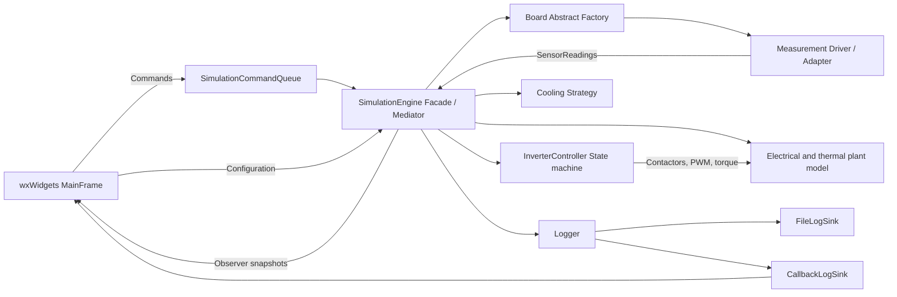

# Embedded Pattern Simulator

`EmbeddedSimulator` is a real wxWidgets desktop application built on the same
inverter controller used by the State-pattern example. It is not a collection of
unrelated demo buttons: the pattern implementations collaborate inside one
periodic simulation.

## What the GUI provides

- Selectable 400 V or 800 V traction-inverter plant.
- STM32H7 or NXP S32K3 board-support family.
- On-chip ADC or isolated sigma-delta measurement frontend.
- 10 kOhm NTC or PT100 temperature device.
- Quiet or performance cooling strategy.
- Ignition, drive request, and requested torque controls.
- Emergency-stop, open-precharge, overtemperature, and overcurrent injection.
- Live inverter state, fault, contactor, PWM, torque, voltage, current,
  temperature, and fan values.
- Scrolling trends for DC-link charge, temperature, and current.
- Timestamped live log plus a persistent log file in the platform user-local
  application-data directory.

## Connected architecture



Patterns used together:

| Pattern | Role in the application |
|---|---|
| Abstract Factory + Factory | Create a board-compatible measurement driver family |
| Adapter | Present board/frontend details as physical `SensorReadings` |
| State | Enforce inverter startup, driving, protection, and reset transitions |
| Strategy | Select the fan-control policy independently of the engine |
| Observer | Publish snapshots to the GUI without a wx dependency in the core |
| Command | Convert menu/button actions into queued simulation operations |
| Facade | Give the GUI one coherent simulation API |
| Mediator | Coordinate plant, driver, controller, cooling, logging, and observers |
| Dependency Injection | Supply logging and hardware capabilities through interfaces |

For concrete participants, source locations, ownership, and end-to-end runtime
flows, see [Design patterns inside EmbeddedSimulator](../docs/EmbeddedSimulatorPatterns.md).

## Typical simulation workflow

1. Select the plant, control board, frontend, temperature sensor, and cooling
   strategy, then press **Apply configuration and reset**.
2. Enable **Ignition on** and press **Start simulation**. Watch the precharge
   relay charge the DC link, the main contactor overlap, and the transition to
   `Ready`.
3. Enable **Drive request** and move the torque slider. PWM, current, thermal
   load, and cooling response become visible.
4. Inject a fault. The State controller immediately opens the power path and
   latches the fault.
5. Remove the injection, turn ignition off, wait for current/temperature to be
   safe, and press **Request fault reset**. Unsafe reset attempts remain rejected.

## Build through vcpkg

The root `vcpkg.json` pins the dependency baseline and declares `wxwidgets`.
Set `VCPKG_ROOT` to your vcpkg checkout and use the supplied presets:

```powershell
$env:VCPKG_ROOT = 'C:\path\to\vcpkg'
cmake --preset msvc-vcpkg-debug
cmake --build --preset build-debug
ctest --preset test-debug
```

Alternatively, open `EmbeddedDesignPatterns.sln`, allow vcpkg manifest restore,
set `EmbeddedSimulator` as the startup project, and run it.

## Verification

`EmbeddedSimulatorTests` is wx-independent. It runs every combination of:

- 2 plant profiles
- 2 board families
- 2 measurement frontends
- 2 temperature devices
- 2 cooling strategies

That is 32 complete startup/drive/overcurrent/reset scenarios, plus an explicit
precharge-open-circuit timeout. The GUI executable also supports
`--smoke-test`, which initializes the native wx event loop and exits immediately.

This is a deterministic engineering simulator, not a validated motor-drive or
HIL plant model. Thresholds and sequencing are representative; do not use its
outputs as production calibration data.

## API and pattern documentation

The detailed [pattern map](../docs/EmbeddedSimulatorPatterns.md) explains the
participants, exact source locations, runtime collaboration, and ownership
rules. The root Doxygen configuration includes the whole solution. From the
repository root, run `doxygen Doxyfile` or use the `msvc-docs` and `build-docs`
CMake presets, then open `out/docs/html/index.html`.
